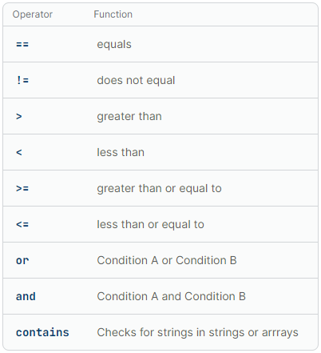
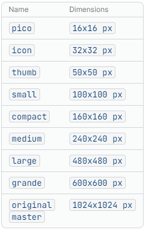

# Liquid Templating

## Liquid templating

Liquid is used to dynamically output objects and their properties. You can further modify that output by creating logic with tags, or directly altering it with a filter.

\


### Syntax

```jsx

 // Defining logic with tags

 // Strip whitespace

{{ name }} // Output tag

{{ name | upcase }} // Modifying output with filters

{{ shop }} // Referencing objects

{{ shop.name }} // Referencing objects properties
```

> Some objects can be accessed globally, and some are available only in certain contexts. Refer to the specific object reference to find its access scope.

\


## Truthy and falsy

All data types must return either `true` or `false`. Those which return `true` by default are called truthy. Those that return `false` by default are called falsy.

Because `nil` and `false` are the only falsy values, you need to be careful how you check values in Liquid. A value might not be in the format you expect, but still be truthy.

For example, empty strings are truthy, so you need to check whether they’re empty with `blank`. `EmptyDrop` objects are also truthy, so you need to check whether the object you’re referencing is `empty`.

> `nil` and `false` are the only falsy values in Liquid templating language.

\


## Whitespace control

Even if it doesn't output text, any line of Liquid outputs a line in your rendered content. By including hyphens in your Liquid tag, you can strip any whitespace that your Liquid generates when rendered.

If you want to remove whitespace on only one side of the Liquid tag, then you can include the hyphen on either the opening or closing tag.

```jsx
// Example


	// Inside if

```

\


## Logical and comparison operators

Liquid supports basic logical and comparison operators for use with [conditional tags](https://shopify.dev/docs/api/liquid/tags/conditional-tags).



\


## Liquid Filters

\


### img\_url

All the sizes accepted by img\_url filter.



Learn more → [https://shopify.dev/docs/api/liquid/filters/img\_url#img\_url-size](https://shopify.dev/docs/api/liquid/filters/img_url#img_url-size)

.\
.\
.\
.\
.\
.\


_✍️ More to be written soon!_
