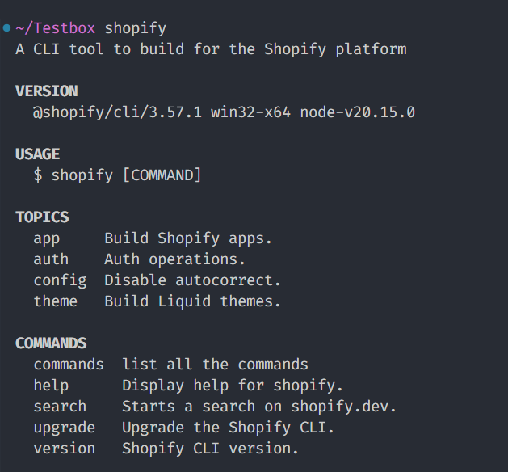

# Shopify CLI

## Shopify CLI

Shopify CLI is a command-line interface tool that helps you generate and work with Shopify apps, themes and custom storefronts. You can also use it to automate many common development tasks.

During writing of this article the Shopify version was **3.63.2**

[Shopify CLI](https://shopify.dev/docs/api/shopify-cli)

## **Requirements**

* [Node.js](https://nodejs.org/en/download/): 18.20+, 20.10 or higher
* [Git](https://git-scm.com/downloads): 2.28.0 or higher

## **Installation**

```bash
# Install latest Shopify CLI
npm install -g @shopify/cli@latest

# Check installed Shopify version
shopify version # 3.63.2

# Upgrade Shopify
shopify upgrade

# Get help
shopify help
```

This installs Shopify CLI globally on your system, so you can run `shopify` commands from any directory. Find out more about the available commands by running `shopify` in your terminal.

Learn more about Shopify CLI at

→ [https://shopify.dev/docs/api/shopify-cli](https://shopify.dev/docs/api/shopify-cli)

## Commands



.\
.\
.\
.\
.\
.\


_✍️ More to be written soon!_
